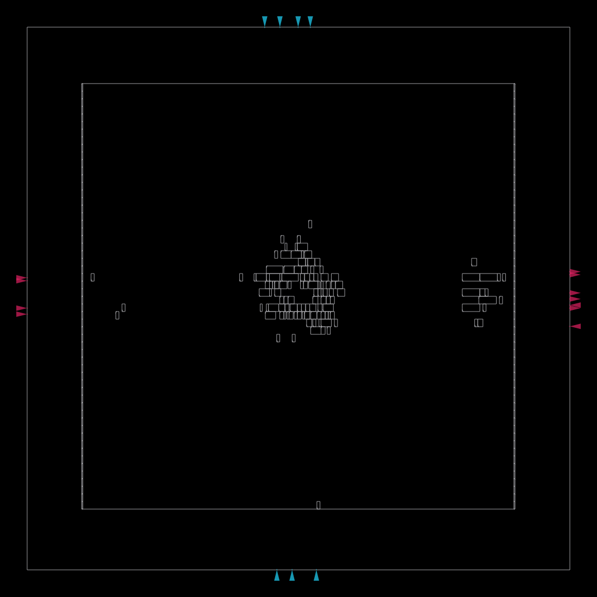
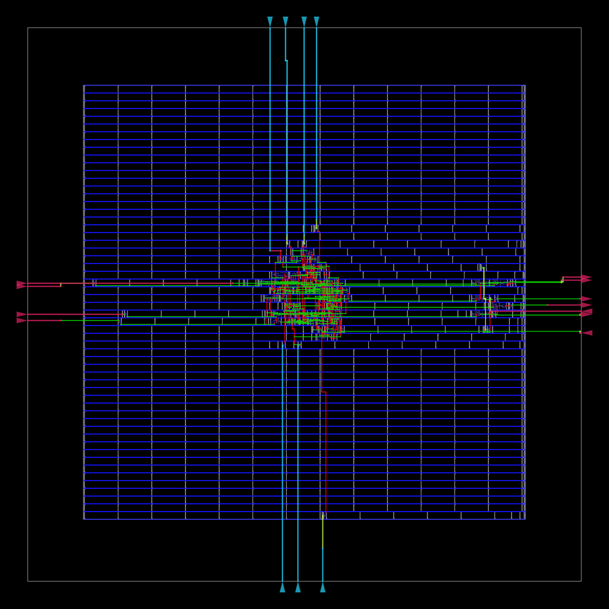
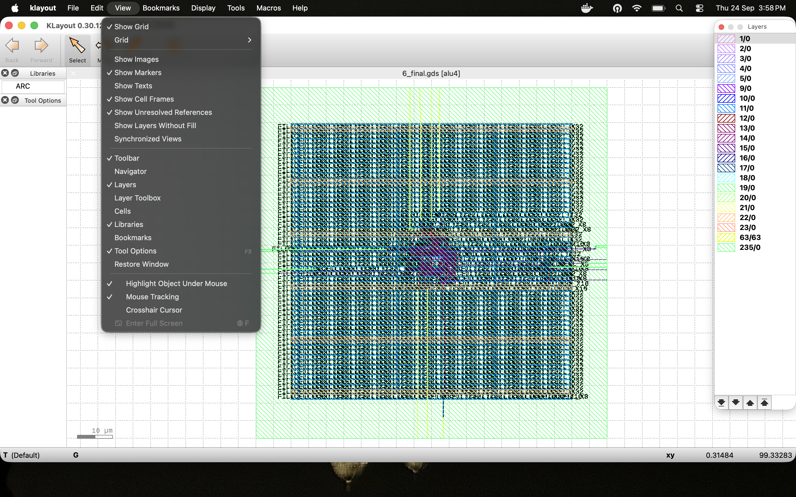

# 4-Bit ALU Physical Design using OpenROAD

## Project Overview

This project implements the RTL-to-GDSII physical design flow of a 4-bit Arithmetic Logic Unit (ALU) using the OpenROAD Flow Scripts (ORFS).

The project demonstrates a complete ASIC physical design flow including RTL synthesis, floorplanning, placement, clock tree synthesis, routing, design-rule checking, and final GDSII generation.

## Tools and Technology

- OpenROAD Flow Scripts
- Yosys
- OpenROAD
- KLayout
- Docker
- Nangate45 Open Cell Library
- Verilog
- SDC
- macOS

## Design

**Design:** 4-bit ALU  
**Technology:** Nangate45  
**RTL Language:** Verilog  
**Physical Design Flow:** RTL-to-GDSII

## Physical Design Flow

The following stages were completed:

1. RTL Design
2. Logic Synthesis
3. Floorplanning
4. Power Distribution Network
5. Global Placement
6. Detailed Placement
7. Clock Tree Synthesis
8. Global Routing
9. Detailed Routing
10. Design Rule Checking
11. Final GDSII Generation

## Final Results

The design successfully completed the OpenROAD RTL-to-GDSII physical design flow using the Nangate45 platform.

| Metric | Result |
|---|---:|
| Technology | Nangate45 |
| Synthesis Area | 155.344 µm² |
| Total Reported Power | 20.2 µW |
| Final Detailed-Routing DRC Violations | 0 |
| Antenna Net Violations | 0 |
| Antenna Pin Violations | 0 |
| Hold Violations | 0 |
| Final GDSII | Successfully Generated |

The detailed router initially reported routing violations during optimization, which were reduced to **zero** by completion of detailed routing.

> **Timing note:** The final report contained no register-to-register timing paths, so a reg-to-reg timing-closure metric is not reported for this design.

## Final Placement



## Final Routing



## Project Structure

```text
alu4-physical-design/
├── rtl/
│   └── alu4.v
├── config/
│   ├── config.mk
│   └── constraint.sdc
├── reports/
│   ├── synth_stat.txt
│   └── 6_finish.rpt
├── images/
│   ├── final_placement.webp.png
│   └── final_routing.webp.png
└── README.md
```
## Final GDSII Layout

The completed physical layout was visualized using KLayout after successful RTL-to-GDSII implementation.


